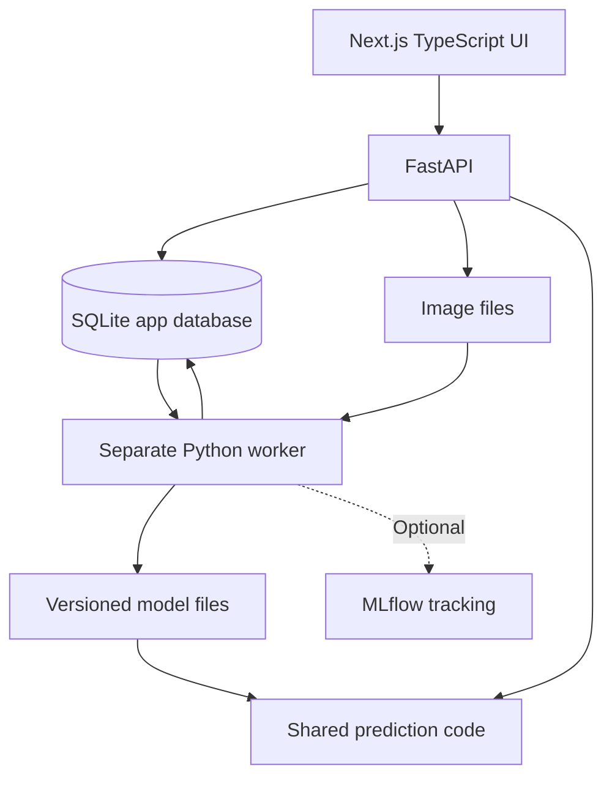

# Architecture

The browser talks only to Next.js at port 3000. Next.js forwards `/api/*` to
FastAPI at port 8000; the API URL is a server-side environment variable. All web
source and configuration is TypeScript. Python owns records and model operations.

## Data and jobs

- Images: normalized path, exact decoded-pixel hash, origin, initial label, fixed split.
- Predictions: original label, all class scores, model version; preserved after review.
- Reviews: append-only labels; the newest review supplies the next training label.
- Runs: fixed JSON snapshot, baseline model ID, phase, progress, heartbeat, error, metrics.
- Models: locally generated artifact, evaluation, gate result; activation history is append-only.

Training creation takes an SQLite write transaction, checks that another run is
not pending, and freezes the labeled records into a snapshot. New reviews cannot
alter a running experiment. Evaluation rows cannot be relabeled in the UI.

One independent worker claims queued jobs transactionally. A heartbeat is updated
while fitting. Runs without a heartbeat for two minutes are failed on the next
worker poll; the user can start a fresh run. A failed run never changes the active
model. Candidate and baseline are evaluated against the same validation images.

Activation checks eligibility relative to the current baseline, loads the local
artifact and performs a prediction before committing the active model ID. Previously
activated models can be restored. Each prediction captures the version it used.

## API

| Method | Route | Purpose |
|---|---|---|
| GET | /overview | Counts, labels, current model, worker health |
| POST | /classify | Multipart image; save and optionally predict |
| GET | /images | Images and latest review/prediction labels |
| GET | /images/{id}/file | Normalized image |
| POST | /images/{id}/review | Append reviewed label for training image |
| POST | /runs | Freeze data and queue run; returns HTTP 202 |
| GET | /runs | Actual phase, progress, metrics, errors |
| GET | /models | Candidate versions and activation eligibility |
| POST | /models/{id}/activate | Validate and activate, or restore a prior version |

The UI polls every four seconds. No simulated predictions, fabricated metrics,
external inference services, or cloud jobs are used.

## Deliberate first-version limits

- Single user; localhost only; no distributed queue, public hosting, or accounts.
- Five configured classes and a small CPU baseline. It will assign one of these
  labels even to an out-of-domain image; rejection/unknown detection is future work.
- MLflow integration is optional and separate from app records.
- Import is a bounded viewer sample, not a full randomized dataset benchmark.
- A ViT trainer, grouped near-duplicate splits, final test evaluation command,
  larger-scale sampling, and AWS execution are follow-up milestones.

## Visual direction

Fashion review workbench with a large image canvas and a quieter prediction panel.
DM Sans provides readable workspace typography. Palette: paper #f7f8fb, ink
#25344b, muted #727e90, border #e4e8ef, violet #6553c7, success #3c826a.
The garment scanning frame is the focal motif. No decorative charts or fake KPIs.
Mobile navigation becomes a top row and the image/prediction panels stack.
